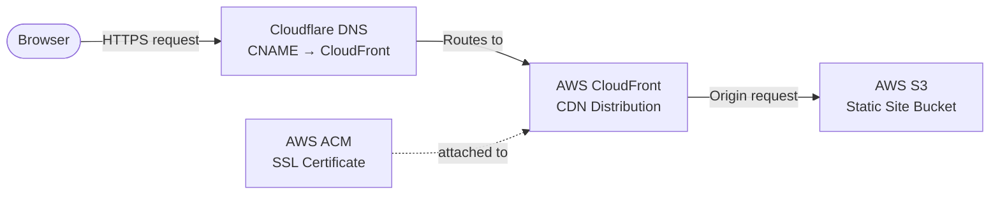

# Deployment Architecture

```mermaid
graph LR
    User([Browser]) -->|HTTPS request| CF["Cloudflare DNS
    CNAME → CloudFront"]
    CF -->|Routes to| CDN["AWS CloudFront
    CDN Distribution"]
    ACM["AWS ACM
    SSL Certificate"] -.->|attached to| CDN
    CDN -->|Origin request| S3["AWS S3
    Static Site Bucket"]
```
